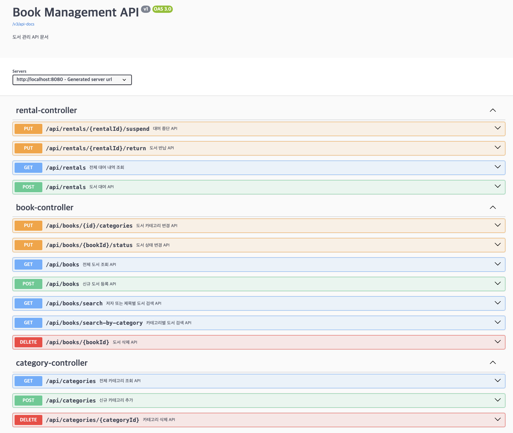
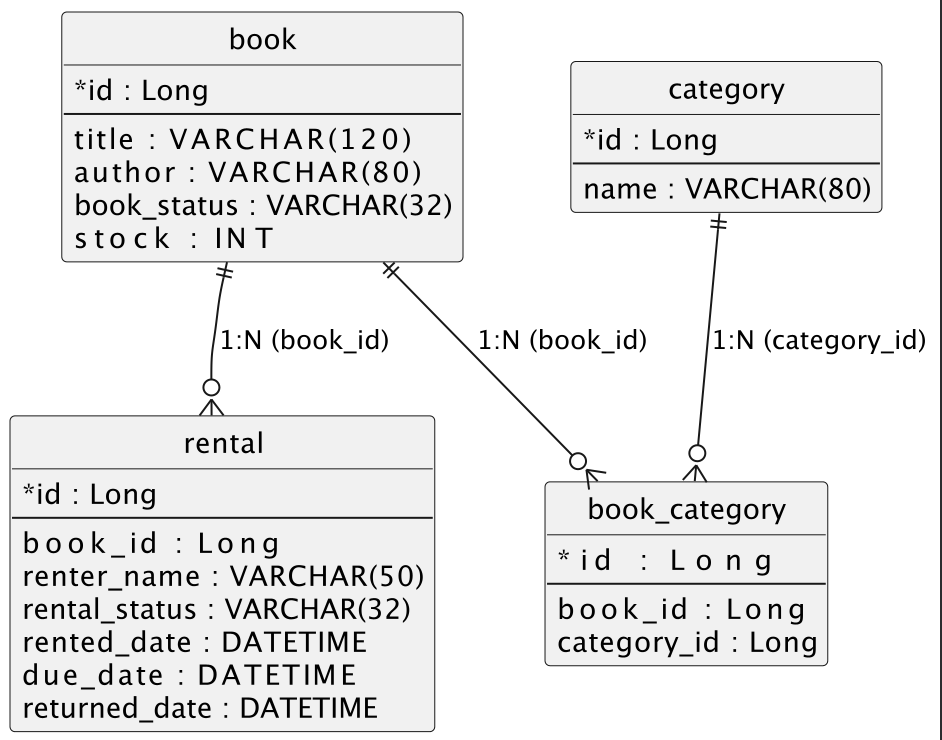
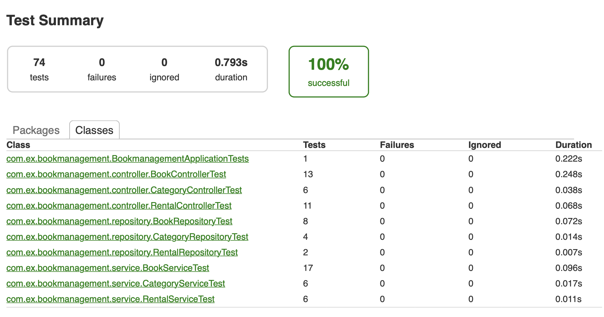

## 📘 Book Management API

### 프로젝트 개요
도서 관리하는 Spring Boot 기반 RESTful API입니다.  
본 프로젝트는 Spring Boot + JPA 기반의 CRUD API 구현 및 Swagger 기반 API 문서화를 목표로 합니다.
<br>
<br>

### 기술스택

| 구분 | 기술                             |
|:------|:-------------------------------|
| **Language** | Java(JDK) 17                   |
| **Framework** | Spring Boot 3.5.7              |
| **ORM** | Spring Data JPA (Hibernate)    |
| **DB** | H2                             |
| **Build** | Gradle                         |
| **API 문서** | springdoc-openapi (Swagger UI) |
| **Test** | JUnit5                         |

<br>

### API 문서 (Swagger UI)

| 항목                | 경로 |
|:------------------|:---------------------------------------------|
| **Swagger UI**    | [http://localhost:8080/swagger-ui/index.html](http://localhost:8080/swagger-ui/index.html) |
| **OpenAPI JSON**  | [http://localhost:8080/v3/api-docs](http://localhost:8080/v3/api-docs) |
| **OpenAPI YAML**  | http://localhost:8080/v3/api-docs.yaml |
| **로컬 저장본 (YAML)** | [./docs/openapi.yaml](./docs/openapi.yaml) |

> Swagger UI에서 API 테스트 및 스펙을 바로 확인할 수 있습니다.

<br>

### Swagger UI 미리보기
> Swagger 기반 화면입니다.

<p>
  
</p>

<br>

### 주요 API 요약

| Method | Endpoint | Description        | Request Body 예시 | Response                 |
|:--|:--|:-------------------|:--|:-------------------------|
| **GET** | `/api/books` | 도서 전체 목록 조회        | - | `List<BookResponse>`     |
| **POST** | `/api/books` | 도서 등록              | `{"title":"...", "author":"...", "bookStatus":"AVAILABLE", "stock":10, "categoryIds":[1,2]}` | `Long`                   |
| **PUT** | `/api/books/{id}/categories` | 도서 카테고리            | `{"categoryIds":[1,2,3]}` | (204 No Content)         |
| **PUT** | `/api/books/{bookId}/status` | 도서 상태 변경           | `{"status":"SUSPENDED_DAMAGED"}` | (204 No Content)         |
| **DELETE** | `/api/books/{bookId}` | 도서 삭제              | - | (204 No Content)         |
| **GET** | `/api/books/search` | 저자/제목 검색(부분일치)     | `?author=...&title=...&page=0&size=10` | `List<BookResponse>`     |
| **GET** | `/api/books/search-by-category` | 카테고리별 검색(ID 또는 이름) | `?categoryId=1` 또는 `?categoryName=여행` | `List<BookResponse>`     |
| **GET** | `/api/categories` | 카테고리 목록 조회         | - | `List<CategoryResponse>` |
| **POST** | `/api/categories` | 카테고리 생성(중복 불가)     | `{"name":"문학"}` | `CategoryResponse`       |
| **DELETE** | `/api/categories/{categoryId}` | 카테고리 삭제            | - | (204 No Content)         |
| **POST** | `/api/rentals` | 도서 대여              | `{"bookId":1,"renterName":"홍길동"}` | `RentResponse`           |
| **PUT** | `/api/rentals/{rentalId}/return` | 도서 반납              | - | (204 No Content)         |
| **PUT** | `/api/rentals/{rentalId}/suspend` | 대여 중단(훼손/분실)       | - | (204 No Content)         |
| **GET** | `/api/rentals` | 대여 내역 전체 조회(최신 순)  | - | `List<RentResponse>`     |

<br>

### 예시 요청/응답

####  도서 등록 (POST `/api/books`)

**Request**
```json
{
  "title": "객체지향의 사실과 오해",
  "author": "저자A",
  "bookStatus": "AVAILABLE",
  "stock": 10,
  "categoryIds": [
    1,
    2
  ]
}
```
**Response**
```json
1
```

**오류 응답 공통 포맷 (예: 존재하지 않는 도서)**
```json
{
"code": "BOOK_NOT_FOUND",
"message": "도서를 찾을 수 없습니다. (id={id})",
"status": 404,
"path": "/api/books/9999",
"timestamp": "2025-11-11T10:00:00Z",
"args": { "id": 9999 }
}
```


<br>

### ERD 
<p>
  
</p>

<br>

### 프로젝트 구조
```css
bookmanagement/
├─ src/
│   ├─ main/java/com/ex/bookmanagement/
│   │   ├─ config/          # Swagger 설정, 공통 설정 클래스
│   │   ├─ controller/      # API 요청을 처리하는 컨트롤러
│   │   ├─ domain/          # JPA 엔티티 클래스
│   │   ├─ dto/             # 데이터 전달용 DTO 클래스
│   │   ├─ exception/       # 예외 처리 및 전역 핸들러
│   │   ├─ repository/      # JPA Repository 인터페이스
│   │   └─ service/         # 비즈니스 로직 서비스 클래스
│   │
│   ├─ test/java/com/ex/bookmanagement/
│   │   ├─ controller/      
│   │   ├─ repository/     
│   │   └─ service/      
│   │
│   └─ resources/
│       └─ application.yml 
│
├─ build.gradle
└─ README.md
```
<br>

### 테스트 리포트 결과 (PDF)

<p>
    
</p>

> 모든 단위 테스트 및 통합 테스트가 성공적으로 통과하였습니다.

<br>
